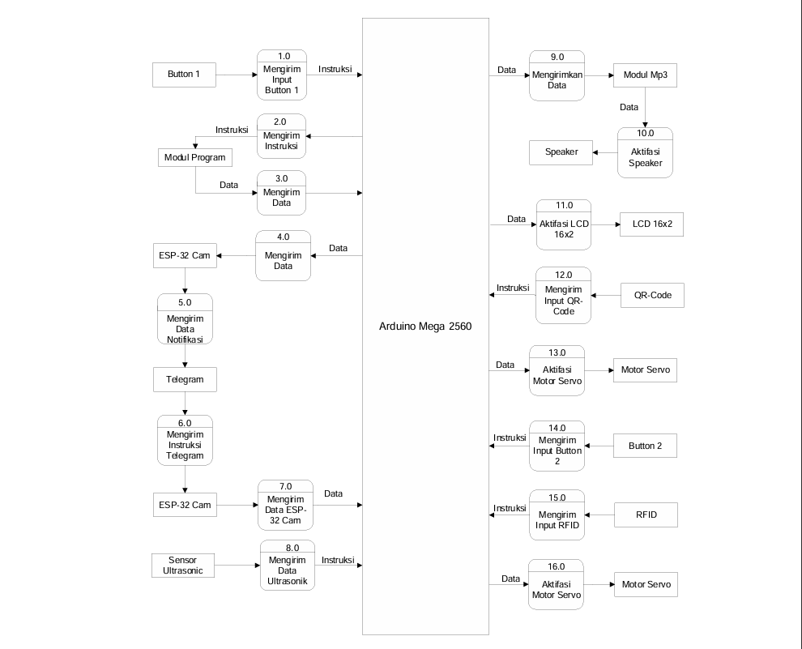
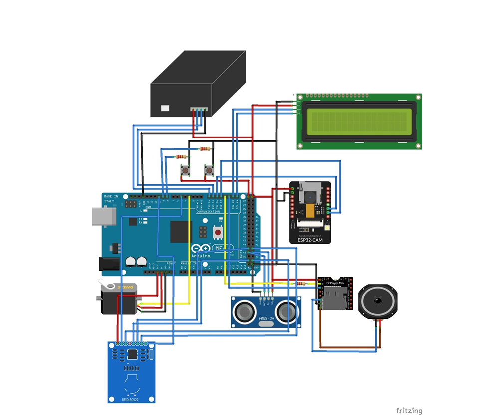

# smart-mailbox-iot
# IoT-Based Smart Mailbox System with QR-Code & Telegram Integration

An IoT-based smart mailbox security system developed as a final thesis project to resolve delivery uncertainties, prevent package theft, and improve package receipt efficiency by up to 95% when recipients are away from home.

## 📌 Project Overview
The system acts as an automated, secure container for online shopping deliveries. It integrates microcontroller processing with real-time cloud notifications, enabling remote package verification via camera snapshots, secure dynamic QR-Code authentication for couriers, and RFID local access for the owner.

## ⚙️ System Architecture & Working Principle
1. **Notification:** Courier presses the input button (`Button 1`), triggering the system to generate a unique dynamic OTP/QR code and notify the homeowner via Telegram.
2. **Verification:** Homeowner sends `/mulai` via Telegram. The ultrasonic sensor checks if the package is within the optimal distance range (50cm – 70cm), and the ESP32-CAM captures and sends a photo of the package for verification.
3. **Access Control:** Once verified, the owner sends `/akses`. The courier scans the generated QR code using the built-in QR Scanner to unlock the door (driven by a Servo Motor).
4. **Completion:** After placing the package inside, the courier presses `Button 2` to close the box, triggering an automated "Thank you" audio feedback via the DFPlayer MP3 module and updating the status on the Telegram bot.
5. **Alternative Access:** An MFRC522 RFID reader is integrated as a secure local fallback method for the owner.

## 🛠️ Hardware & Technology Stack
* **Main Controller:** Arduino Mega 2560
* **IoT & Camera Module:** ESP32-CAM (Wi-Fi & Telegram Bot API)
* **Security & Input:** QR-Code Scanner, MFRC522 RFID Reader, Push Buttons
* **Sensors & Output:** HC-SR04 Ultrasonic Sensor, Servo Motor (Lock mechanism), 16x2 I2C LCD, DFPlayer Mini MP3 Module & Speaker
* **Software:** Arduino IDE, Fritzing (Circuit design), Google SketchUp (Enclosure design)

## 📂 Repository Structure
* `/arduino` : Contains the main control program for Arduino Mega.
* `/ESP32-CAM` : Contains the Wi-Fi and Telegram camera server script.

## 🖼️ System Diagrams & Schematics
* **Block Diagram:** 
  
* **Data Flow Diagram:** 
  
* **Fritzing Schematic:** 
  
